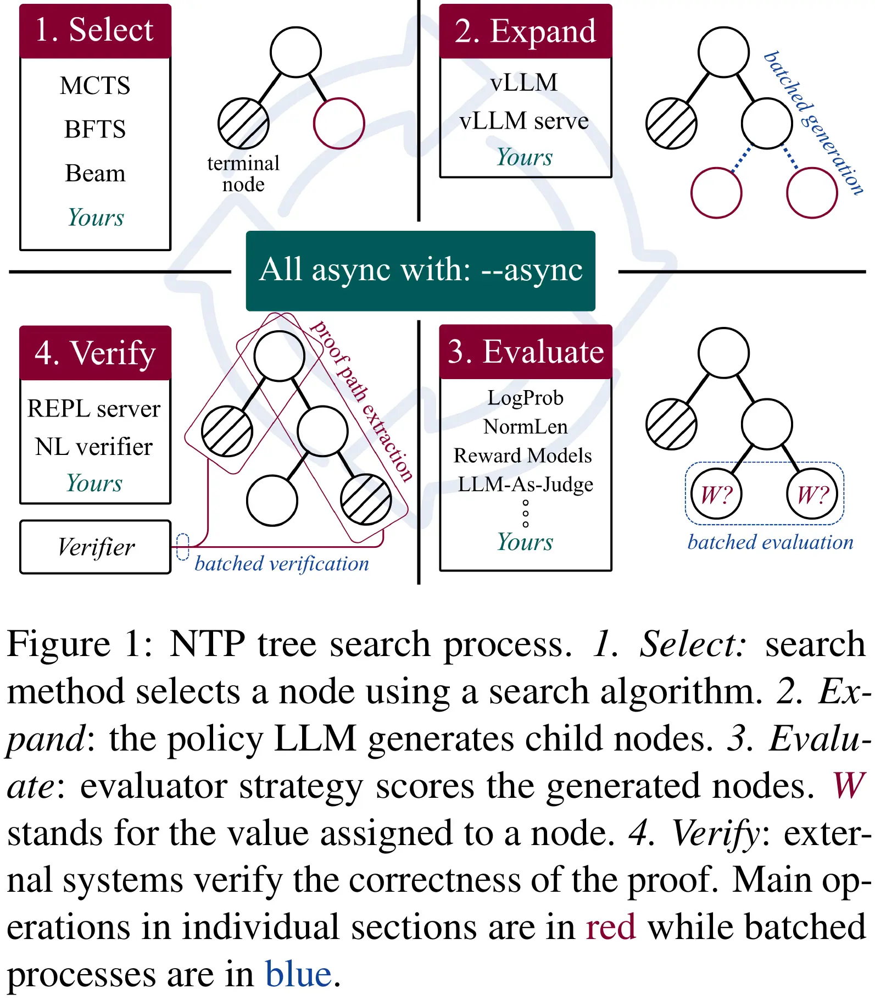
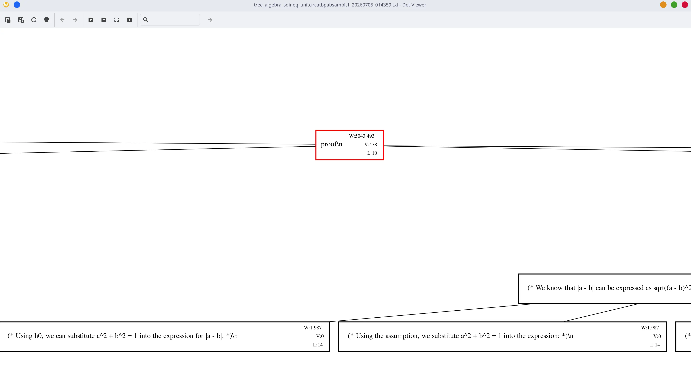
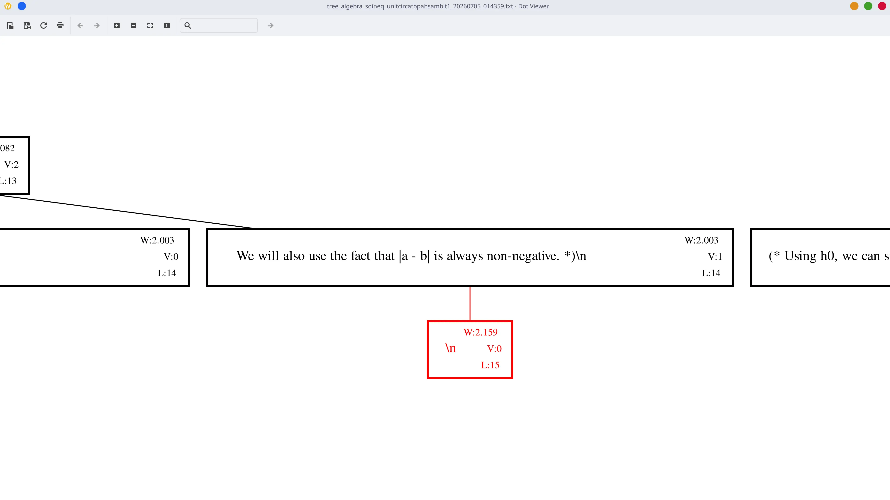
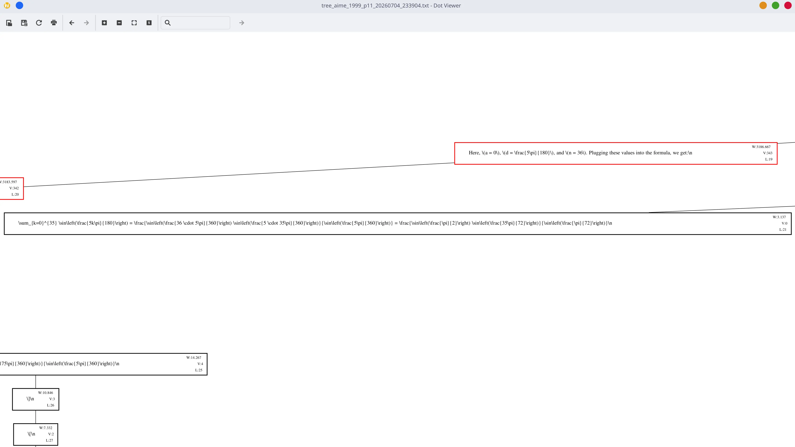
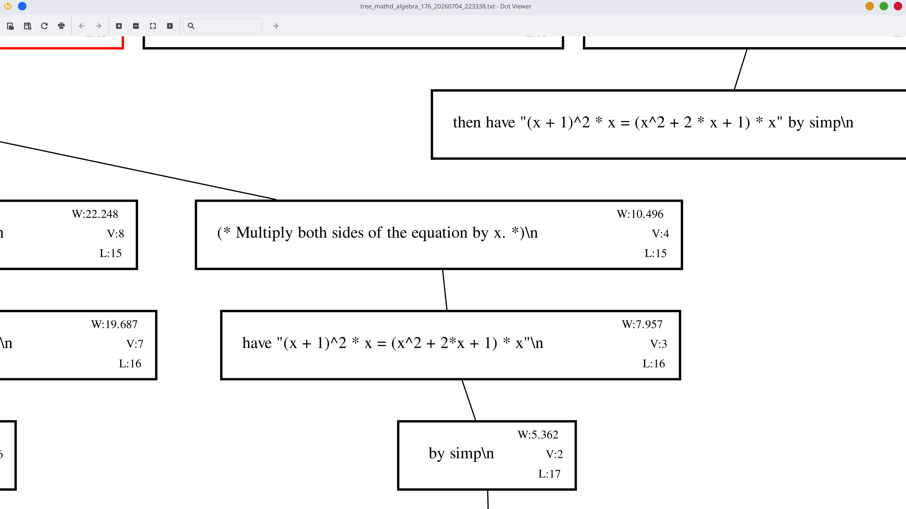
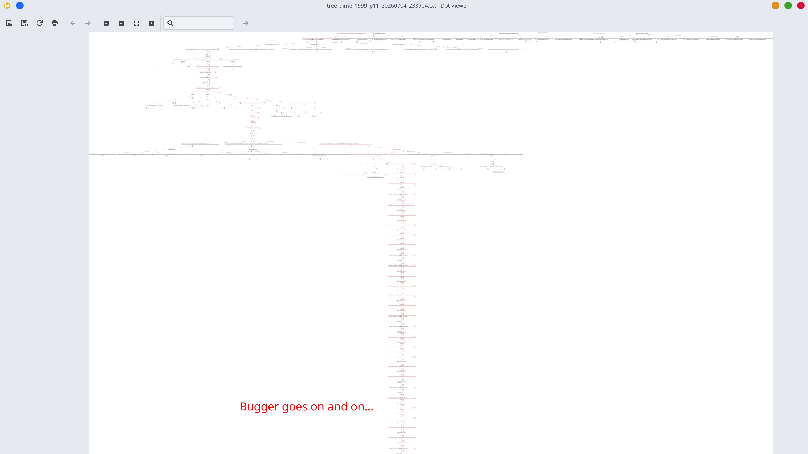

## TL;DR
`TreeThink` is a modular and fully asynchronous library for tree search in the domain of formal mathematical reasoning. In this post, I aim to explain its inner workings, design decisions, and ultimately what I gained during the project. 

## Relevant Links
You can directly jump into what we released:

- Paper: https://arxiv.org/abs/2607.11258
- PyPI Release: https://pypi.org/project/treethink/
- Repo: https://github.com/GGLAB-KU/treethink
- Video: https://youtu.be/vKFXxnjlk8M?si=Z9iUMgrq54CXNRzX

## Background
### Whys and hows of tree search
Say you are making an LLM solve a math problem. In conventional inference, when you send a request to LLM inference server, you get a single answer, a single attempt for LLM to provide a solution. A popular metric for assessing the abilities of LLM is `pass@k`. It is extremely simple to explain: model attempts to solve the question `k` times, if only a single one of the attempt succeeds, model is considered to be able to solve that question. I feel like tree search at inference time is the next step for `pass@k`, just like `pass@k` itself is a better attempt compared to single pass inference. 

With tree search methods, we aim to prune wrong proof paths, try to guide the models' final output to a proper solution. There are many ways to achieve it, although, when we inspect the literature, we dominantly see Monte Carlo Tree Search (MCTS) and Best First Tree Search (BFTS) algorithms applied in problem solving tasks. Especially MCTS is popular due to AlphaZero's success.

My figure from the paper alongside its foot note, explaining the general tree search mechanism:



### What is formal math
I believe formal mathematics is best understood once we define what informal mathematics is. Informal mathematics is the conventional way of writing proofs: mathematicians logically list the necessary steps, theorems, lemmas etc. accompanied with a natural language explanation. Once the writing is done, the steps are (hopefully) checked by other mathematicians, and any mistakes are identified. This is a tedious and error-prone process, as it is solely bound to human brain power.

Formal math aims to automate the checking process. You write your proofs using a programming language-like syntax, and formal language compiler checks its validity, i.e. if all goals are satisfied.

Here are three formal proofs from the languages we support, demonstrating commutativity of logical conjunction ($P \land Q \implies Q \land P$): 

```lean4
-- Lean 4 proof:
theorem and_comm {P Q : Prop} : P ∧ Q → Q ∧ P := by
  intro h
  cases h with
  | intro hp hq =>
    constructor
    · exact hq
    · exact hp
```

```coq
(* Isabelle proof: *)
theorem and_comm: "P ∧ Q ⟹ Q ∧ P"
  apply (erule conjE)
  apply (rule conjI)
   apply assumption
  apply assumption
  done
```

```coq
(* Rocq proof: *)
Theorem and_comm : forall P Q : Prop, P /\ Q -> Q /\ P.
Proof.
  intros P Q h.
  destruct h as [hp hq].
  split.
  - exact hq.
  - exact hp.
Qed.
```

## Design
Now that I've given the necessary background I can discuss the project itself. There are a total of 5 building blocks that made up the search system:
- Tree data structure
- Search strategy/algorithm/method
- Evaluation of a proof trajectory
- LLM inference
- Formal proof checker environments

This building blocks translate to (`XYZ` refers to different strategies):
- `class Node`
- `class XYZMethod`
- `class XYZEvaluator`
- `class XYZPolicy`
- `class XYZClient`

If you are familiar with other tree search libraries such as FETCH or LLM Reasoners, you can be surprised to not see something like `Transition` in the list. Contrary to those works, I believe `Transition` is just a string concatenation operation, which I simply do it during the proof path construction.

I believe the most important feature of the whole project is all these building blocks having asynchronous counterparts. With a single `--async` flag, you can run the entire search process in an asynchronous fashion, gaining huge speedups:

```python
class MethodType(Enum):
    """Enum mapping method config names to their implementation classes."""

    # Sync methods
    RF_MCTS = "RFMCTS"
    BEAM_SEARCH = "BeamSearch"
    BFTS = "BFTS"
    TRADITIONAL_MCTS = "TraditionalMCTS"

    # Async methods
    ASYNC_RF_MCTS = "AsyncRFMCTS"
    ASYNC_BEAM_SEARCH = "AsyncBeamSearch"
    ASYNC_BFTS = "AsyncBFTS"
    ASYNC_TRADITIONAL_MCTS = "AsyncTraditionalMCTS"
```

Another common feature for these blocks is their **registries** and **factory methods**. With a couple of `dataclass`es, or a dictionary with few keys, you can construct them all. My main intend from the start was to be able to control every parameter with a `.yaml` file. Ultimately, I needed to let some of the arguments stay at the CLI such as `--async` or `--num-iterations` as it did not make sense to put them into configuration file.

```python
def get_method(
    treethink_config, root_node, policy, evaluator, rollout_evaluator=None
):
    """Instantiate a method from config using :class:`MethodType`."""
    try:
        method_type = MethodType.from_str(treethink_config.method_name)
        return method_type.initialize(
            root_node=root_node,
            policy=policy,
            evaluator=evaluator,
            rollout_evaluator=rollout_evaluator,
            **treethink_config,
        )
    except (ValueError, KeyError):
        ...

```


Now, I'd like to explain the building blocks individually without going into too detail and without repeating the explanations at the paper too much:

### Tree data structure
Like most of the research oriented libraries, `TreeThink` is written in Python. Writing a linked list is as easy as defining a `Node` class which has `children: List[Node]`. Of course, node class itself comes with a few handy features like constructing its Graphviz output for visualing the tree or remove duplicate children to de-duplicate identical proof paths.

### Search Methods 
We support four search strategies: MCTS, BFTS, Beam Search, and RFMCTS (less computationally expensive alternative of MCTS inspired by AlphaZero). These methods acts as the main orchestrator for the research process. It encapsulates the evaluation strategy, policy, and constructs proof client, and runs the core search loop with `simulate` (or asynchronous variant `async_simulate`).

As I said, I won't go into detail each of them, you can see their more formal explanation at the [paper](https://arxiv.org/abs/2607.11258), and inspect their implementation under `src/treethink/methods/` folder in the [repo](https://github.com/GGLAB-KU/treethink/tree/main/src/treethink/methods).

### Evaluators
Evaluators give a `score: float` to the newly generated children. We've implemented evaluators that were previously used in similar search scenarios, ranging from heuristic ones (like cumulative log probability of the tokens) to neural ones (like another LLM judge). I highly recommend you to see the paper for the full list and thorough explanations. Nonetheless, I'll give it enum definition:

```python
# Recall that we also have async pairs!
# Just add ASYNC_XYZ or AsyncXYZ
class EvaluatorType(Enum):
    CUMULATIVE_LOGPROB = LogprobEvaluator
    REPL = REPLEvaluator
    LLM_AS_JUDGE = JudgeEvaluator
    TOURNAMENT = TournamentEvaluator
    NORMALIZED_LENGTHS = NormLenEvaluator
    NORMALIZED_LENGTHS_PROBS = NormLenProbEvaluator
    RMAXTS = RMaxTSEvaluator
    PROOF_LEVEL_REWARD = ProofLevelRewardEvaluator
    STATE_LEVEL_REWARD = StateLevelRewardEvaluator
```

### Policies
In other words, LLM itself which is responsible for sending requests, parsing the output and generating the child nodes. Number of child nodes to be generated (and alongside many parameters for controlling the search process) can be given inside search configuration. Optionally, user can enable de-duplication which is a simple yet powerful feature to remove identical generated nodes. As for parsing the generation output and constructing the node, we employ two parsing variants: XML-tag delimited, and simple next line parsing. Prompting the model to use `<PROOF_STEP>...<\PROOF_STEP>`, or any similar parsing strategy, enables more structured output that can be easily parsed into a node (which we support via a parameter `parse_tag`). On the other hand,  next line parsing strategy gives `\n` as the stop token as inference parameter, and we parse the sentence/paragraph into a node.

I'd like to discuss a few points regarding to possible parsing strategies for formal mathematics here. You see, in formal math languages, proof steps are clear to extract, they are called *tactic*s. While next line parsing works most of the time, it does not always make sense. Let me give a few example:

1. Too few characters. They do not "logically" make up a proof step, and almost always end up de-duplicated into a single child.




2. Too long informal thinking. Sometimes we can break the reasoning or proof step into two or more steps.


3. Informal reasoning produces a single formal step, indicating a de-duplication during . Model is sure about this proof step as a whole, but we tear it into two steps.


As you can see, I am pretty bothered with these problems, and am still thinking how a better parsing strategy can be implemented. I had a few ideas (which I can't remember precisely) that planned to utilize some form of `StoppingCriteria` similar to those found in `transformers` library, however, `vLLM` does not support anything like it. I think there is an open issue regarding to it, but not a lot of people are fond of it so I don't know if we'll ever see it in the main release anytime soon. (Maybe I should attempt to implement it...)

We support `vLLM` based inference with `LLM` and `AsyncLLM` interfaces or

### Clients
Clients communicate with formal language servers which runs corresponding languages' Read-Eval-Print-Loop (REPL) interfaces. There are numerous server and client implementations for languages we aimed to support, and I present my notes regarding to them. The first bullet points are the ones we chose to use in the end:

*For Lean 4:*
- [Kimina Lean Server](https://github.com/project-numina/kimina-lean-server): really fast, good documentation, caching mechanism too.
- [DeepSeekProverV1.5's implementation](https://github.com/deepseek-ai/DeepSeek-Prover-V1.5/tree/main/prover/lean): looks good, may be extensible upon?
- [LeanDojo](https://github.com/lean-dojo/leandojo): requires a lot to create a fine-grained, fast verifier server.
- Our implementation: slow, really slow.

*For Rocq:*
- [rocq-ml-toolbox](https://github.com/LLM4Rocq/rocq-ml-toolbox): large scale verification framework. Does not have an easy to use client though.
- [pytanque](https://github.com/LLM4Rocq/pytanque): kimina-lean-server like server and client talk. Seems pretty good. 
- [coqpyt](https://github.com/sr-lab/coqpyt): uses rocq-lsp under the hood, seems solid, well-designed library with many examples. Not sure if it has concurrency and/or async.
- [rocq-community/rocq-lsp](https://github.com/rocq-community/rocq-lsp#Features): A regular lsp, has good support for script-driven verification pipelines.

*For isabelle:*
- [isabelle-client](https://github.com/inpefess/isabelle-client): 2 month ago. Seems well documented and easy to use, has a demo paper which is a plus.
- [ISA-REPL](https://github.com/xqyww123/Isa-REPL): python API seems ok but 
- [PISA](https://github.com/albertqjiang/Portal-to-ISAbelle): too old, and seems a bit heavy.

Story time: when I started working with the group, we were initially helping to get verification results for `pass@k` results. The verification process was offline, meaning that the inference outputs were already taken we were only to verify the outputs. We were using [lean REPL](https://github.com/leanprover-community/repl) with a pretty simple custom client script at the time, and the verification process used to took ages. Then, I decided to set out to find the fastest implementation specifically for Lean 4. Here are my results with different concurrency levels:

| **Implementation** | **Core** | **Batch** | **Total Time (s)** | **Avg. Time (s)** |
| ------------------ | -------- | --------- | ------------------ | ----------------- |
| kimina-lean-server | 1        | 8         | 77.51              | 0.32              |
| kimina-lean-server | 1        | 16        | 84.71              | 0.35              |
| kimina-lean-server | 8        | 8         | 99.22              | 0.41              |
| kimina-lean-server | 8        | 16        | 95.42              | 0.39              |
| kimina-lean-server | 4        | 32        | 95.42              | 0.39              |
| DeepSeekProverV1.5 | 8        | -         | 131.72             | -                 |
| DeepSeekProverV1.5 | 1        | -         | 790.90             | -                 |
| Our initial        | 8        | -         | 222.32             | -                 |
| Our initial        | 1        | -         | 881.60             | -                 |

Well, I'll be straight: bloody painful to work with those client and server implementations. Blown up experiments just because the proof assistant client decided to shutdown, or throw some random error that is impossible to reproduce, or out-of-date (or even lack-of) documentation. I've only recently seen [this paper](https://neurips.cc/virtual/2025/loc/san-diego/131121) that merges the three formal languages we support into a unified client. If I hadn't already written a similar interface before them, I would probably use that to at least ease out my pain a bit.

## Results
We demonstrated the performance of cross language inference across Lean 4, Isabelle, and Rocq. The key result here is that you can switch languages by changing `language` parameter and modifying the prompt if you like. I am aware that there aren't many works that focuses or would focus on multi-lingual formal proof writing, therefore, I also made it possible to download specific dependencies for corresponding languages. 

With asynchronous features enabled, we've achieved x6 speedup, which really helps experimentation as the main intend behind writing this framework is to conduct more research in the area. We'll hopefully share more results that utilizes novel ideas in both training and inference pretty soon. 

Moreover, I should note that we've tested the framework on natural language as well and achieved better results compared to single pass and majority voting evaluation strategies.

## What I learned
### Technical aspects
I'll provide a straight claim of what I think I learned, then explain it accordingly.

1. **Encapsulation is sometimes actually useful to reduce clutter.** I am using OOP features in Python or reading how it is used in other repos for quite some time. Although encapsulation is not something Python cares about in plain sight, us as developers need to. I've always seen encapsulation as a bottleneck, writing all those getters and setters for no particular reason did not fit me. Set this as private, set that as public but a few weeks later you realize some public thing should be private and vice versa, I don't like these. However, I believe I've seen a fair usage of encapsulation during this project where we have many parameters and we need to distribute them to corresponding objects. Sharing the parameters with everyone is not a good idea, everyone actually has their own responsibility and they only require a portion of the parameters etc. Basically do not share everything with everyone, just like in real life.
2. **Use recursion when you gain a ton, not because it's cooler.** I like recursion (best explained by Nic Barker's [this video](https://www.youtube.com/watch?v=YuaJ8x_NcLw) btw), it makes you code less and actually makes sense in specific scenarios. All the tree construction and searching etc. is especially a good area, at least that's what I thought initially. I've written `Node::print_node` that writes graphviz to an output file and `RFMCTS::_backpropagate_node_win_value` which updates the scores of the proof steps along the proof path recursively. Later on, I've ran an experiment with 1024 total expansion count. Care to guess what happened?


 
3. **Tree search algorithms are neat.** I've had my fair share of tree search algorithms, written a lot of buggy code, debugged it myself and with AI for hours. Hope it will be useful next semester at our algorithms lectures.
4. **HPCs are awesome.** We initially worked in KUACC, Koç University's (old) computing cluster. Then, we migrated to VALAR because they moved the GPUs we used. After that, we got accepted to use Maestrom5 which is a fantastic place. I used to use V100s on KUACC, then used A40s on VALAR. A few A100s on my training jobs too. I remember my hands shaking before sending jobs to these monstrous GPUs, then I got quite used to it which I think is a great skill. 
5. **Containers, containers, and more containers.** Glibc on our first HPC KUACC was extremely old, so old that Lean compiler itself do not work. I initially tried to contain it using singularity container system. I had problems that I could not solve (don't exactly remember now), so I've looked at alternatives. I tried a docker-like container for HPC systems other than singularity, failed miserably too. I tried using module system (which a more recent version of glibc *seemed* to be present until I discovered it was errorneous too. I was about to compile a more recent version of glibc inside conda environment, thankfully we transitioned to VALAR. Just update it man, I think you can find a stable yet recent enough packages, no?
5. **`vLLM` is a beast.** During the research I've also looked into a bit to CUDA, I believe I am at a level where I can understand basic CUDA implementations. Thus, I'd like to look into `vLLM`'s source code, understand how core algorithms work that fast, and the inference process is carried out.
7. **Designing a large (somewhat) large code base requires many well-thought decisions.** I don't want to say that "it was so hard, I rewrote it multiple times" even though that was the case but rather it requires carefully planning. I am sure it is especially important in code bases that is actually shipped to production and have many working on the project. Refactoring is not something developers should do regularly, write good and maintainable code that does not need refactor.

### Soft skills
I think I can say that this is my first time working with a group in which everyone actively works on the project *and* there are members whose knowledge is far greater than me. I believe, expressing your ideas clearly and honestly is key to a good research experience. With many online and face to face meetings done, emails exchanged, reports written, I hope I improved my communication skills. 

### Writing
Developing is one thing, researching is another. I used to be comfortable with both. But writing, oh no, almost no experience on that one. I am saying almost because I've written reports for high school competitions before, both in English and Turkish. However, writing an actual CS paper requires a lot more. We do not tolerate insufficiently explained concepts, claims without citations, and English teachers' favorite way of formal tongue: passive voice.

I'd like to thanks Zeynel once more for letting me experience the writing process by assigning me the first author role!

## Conclusion
I'd like to thanks our advisor [Gözde Gül Şahin](https://gozdesahin.github.io/) for her support during the project, and my teammate [Can S. Erer](https://www.linkedin.com/in/erer-can/) with her contributions to repo, and once more [Zeynel A. Uluşan](https://zeynelulusan.com/tr/) for leading the whole thing splendidly and answering every stupid question I had :).

With all the experience I gained during this research, I hope I can move forward to the next chapter with a lot more confidence. I can't wait to delve into research once more!

